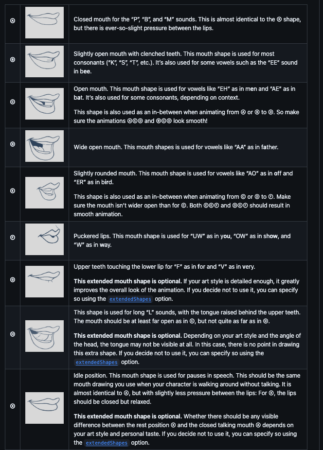
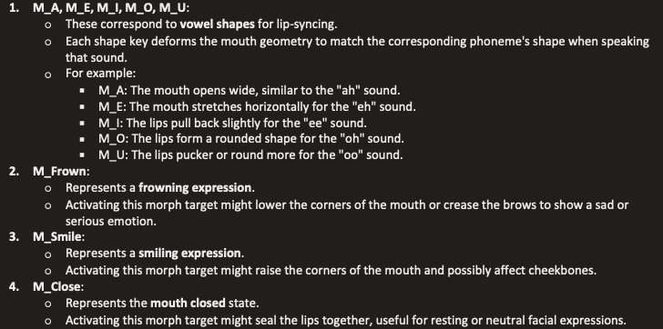
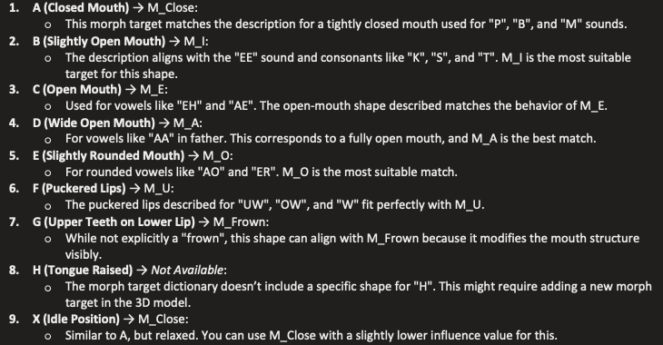

BE side processes audio and generates mouth shape based on characters (A, B, C,...)
link to lib: https://github.com/DanielSWolf/rhubarb-lip-sync?tab=readme-ov-file

FE side uses @react-three/fiber library to represent the action for the mouth of 3D model
link to lib: https://r3f.docs.pmnd.rs/api/hooks#usegraph

Logic generate from BE:


Logic to take the mouth action from FE:


New rhubarb-lip-sync -> @react-three/fiber mapper:


### the old logic map:

```
const MAP = {
A: "M_A",
B: "M_E",
C: "M_I",
D: "M_O",
E: "M_U",
F: "M_Close",
G: "M_Frown",
};
```

### the new logic map:

```
const morphMapper = {
A: "M_Close", // Closed mouth
B: "M_I", // Slightly open mouth, clenched teeth
C: "M_E", // Open mouth
D: "M_A", // Wide open mouth
E: "M_O", // Slightly rounded mouth
F: "M_U", // Puckered lips
G: "M_Frown", // Upper teeth touching lower lip
H: null, // Not available in morphTargetDictionary
X: "M_Smile", // Idle position
};
```
